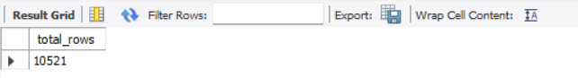
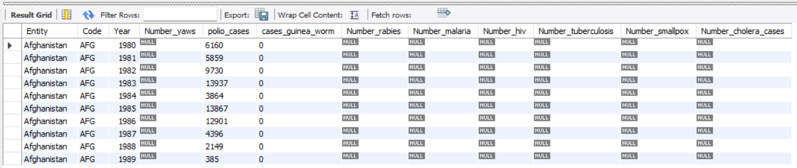
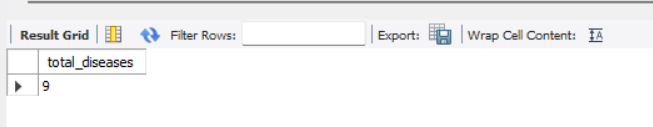
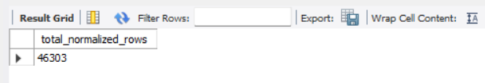
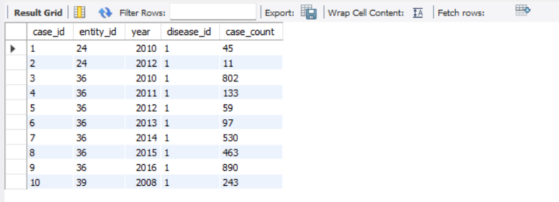
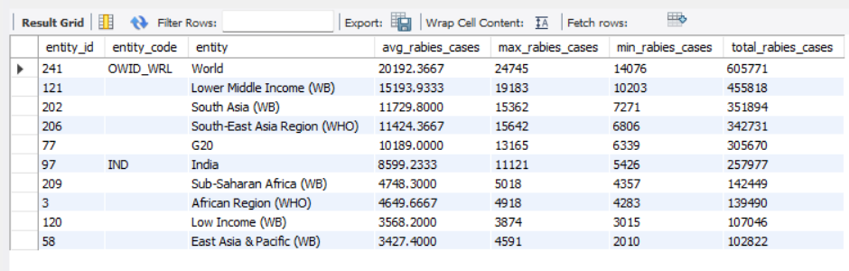
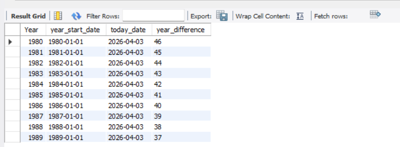
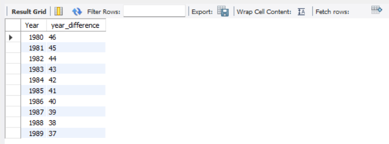

# Final Project — Relational Databases

## Project Overview

This project demonstrates data import, normalization to 3NF, analytical aggregation, work with built-in date functions, and creation of a custom SQL function.

Database schema used in the project: `pandemic`

Main SQL script: `final_project.sql`

---

## Repository Structure

```text
.
├── README.md
├── final_project.sql
└── images/
    ├── step1_count.png
    ├── step1_preview.png
    ├── step3_entities.png
    ├── step3_diseases.png
    ├── step3_normalized_count.png
    ├── step3_normalized_preview.png
    ├── step4_rabies_analysis.png
    ├── step5_year_difference.png
    └── step6_custom_function.png
```

---

## Step 1. Create schema and import data

The schema `pandemic` was created and selected as the default schema.
The source CSV file was imported into the table `infectious_cases`.

### SQL

```sql
DROP SCHEMA IF EXISTS pandemic;
CREATE SCHEMA pandemic;
USE pandemic;

DROP TABLE IF EXISTS infectious_cases;

CREATE TABLE infectious_cases (
    Entity VARCHAR(255),
    Code VARCHAR(50),
    Year YEAR,
    Number_yaws BIGINT NULL,
    polio_cases BIGINT NULL,
    cases_guinea_worm BIGINT NULL,
    Number_rabies BIGINT NULL,
    Number_malaria BIGINT NULL,
    Number_hiv BIGINT NULL,
    Number_tuberculosis BIGINT NULL,
    Number_smallpox BIGINT NULL,
    Number_cholera_cases BIGINT NULL
);
```

### Data import

```sql
LOAD DATA LOCAL INFILE 'C:/path/to/infectious_cases.csv'
INTO TABLE infectious_cases
FIELDS TERMINATED BY ','
ENCLOSED BY '"'
LINES TERMINATED BY '\r\n'
IGNORE 1 ROWS
(
    Entity,
    Code,
    Year,
    @Number_yaws,
    @polio_cases,
    @cases_guinea_worm,
    @Number_rabies,
    @Number_malaria,
    @Number_hiv,
    @Number_tuberculosis,
    @Number_smallpox,
    @Number_cholera_cases
)
SET
    Number_yaws = NULLIF(@Number_yaws, ''),
    polio_cases = NULLIF(@polio_cases, ''),
    cases_guinea_worm = NULLIF(@cases_guinea_worm, ''),
    Number_rabies = NULLIF(@Number_rabies, ''),
    Number_malaria = NULLIF(@Number_malaria, ''),
    Number_hiv = NULLIF(@Number_hiv, ''),
    Number_tuberculosis = NULLIF(@Number_tuberculosis, ''),
    Number_smallpox = NULLIF(@Number_smallpox, ''),
    Number_cholera_cases = NULLIF(@Number_cholera_cases, '');
```

### Validation queries

```sql
DESCRIBE infectious_cases;

SELECT COUNT(*) AS total_rows
FROM infectious_cases;

SELECT *
FROM infectious_cases
LIMIT 10;
```

### Screenshots

Imported row count:



Preview of imported data:



---

## Step 2. Normalize data to 3NF

The original table contains repeated `Entity` and `Code` values and stores diseases as separate columns.
To normalize the structure, the data was transformed into three related tables:

* `entities`
* `diseases`
* `infectious_cases_normalized`

### SQL

```sql
DROP TABLE IF EXISTS infectious_cases_normalized;
DROP TABLE IF EXISTS diseases;
DROP TABLE IF EXISTS entities;

CREATE TABLE entities (
    entity_id INT AUTO_INCREMENT PRIMARY KEY,
    entity_name VARCHAR(255) NOT NULL,
    entity_code VARCHAR(50) NOT NULL,
    UNIQUE (entity_name, entity_code)
);

CREATE TABLE diseases (
    disease_id INT AUTO_INCREMENT PRIMARY KEY,
    disease_name VARCHAR(100) NOT NULL UNIQUE
);

CREATE TABLE infectious_cases_normalized (
    case_id BIGINT AUTO_INCREMENT PRIMARY KEY,
    entity_id INT NOT NULL,
    year YEAR NOT NULL,
    disease_id INT NOT NULL,
    case_count BIGINT NOT NULL,
    FOREIGN KEY (entity_id) REFERENCES entities(entity_id),
    FOREIGN KEY (disease_id) REFERENCES diseases(disease_id)
);
```

### Fill lookup tables

```sql
INSERT INTO entities (entity_name, entity_code)
SELECT DISTINCT Entity, Code
FROM infectious_cases;

INSERT INTO diseases (disease_name)
VALUES
    ('Number_yaws'),
    ('polio_cases'),
    ('cases_guinea_worm'),
    ('Number_rabies'),
    ('Number_malaria'),
    ('Number_hiv'),
    ('Number_tuberculosis'),
    ('Number_smallpox'),
    ('Number_cholera_cases');
```

### Fill normalized fact table

```sql
INSERT INTO infectious_cases_normalized (entity_id, year, disease_id, case_count)
SELECT e.entity_id, ic.Year, d.disease_id, ic.Number_yaws
FROM infectious_cases ic
JOIN entities e
    ON ic.Entity = e.entity_name AND ic.Code = e.entity_code
JOIN diseases d
    ON d.disease_name = 'Number_yaws'
WHERE ic.Number_yaws IS NOT NULL

UNION ALL

SELECT e.entity_id, ic.Year, d.disease_id, ic.polio_cases
FROM infectious_cases ic
JOIN entities e
    ON ic.Entity = e.entity_name AND ic.Code = e.entity_code
JOIN diseases d
    ON d.disease_name = 'polio_cases'
WHERE ic.polio_cases IS NOT NULL

UNION ALL

SELECT e.entity_id, ic.Year, d.disease_id, ic.cases_guinea_worm
FROM infectious_cases ic
JOIN entities e
    ON ic.Entity = e.entity_name AND ic.Code = e.entity_code
JOIN diseases d
    ON d.disease_name = 'cases_guinea_worm'
WHERE ic.cases_guinea_worm IS NOT NULL

UNION ALL

SELECT e.entity_id, ic.Year, d.disease_id, ic.Number_rabies
FROM infectious_cases ic
JOIN entities e
    ON ic.Entity = e.entity_name AND ic.Code = e.entity_code
JOIN diseases d
    ON d.disease_name = 'Number_rabies'
WHERE ic.Number_rabies IS NOT NULL

UNION ALL

SELECT e.entity_id, ic.Year, d.disease_id, ic.Number_malaria
FROM infectious_cases ic
JOIN entities e
    ON ic.Entity = e.entity_name AND ic.Code = e.entity_code
JOIN diseases d
    ON d.disease_name = 'Number_malaria'
WHERE ic.Number_malaria IS NOT NULL

UNION ALL

SELECT e.entity_id, ic.Year, d.disease_id, ic.Number_hiv
FROM infectious_cases ic
JOIN entities e
    ON ic.Entity = e.entity_name AND ic.Code = e.entity_code
JOIN diseases d
    ON d.disease_name = 'Number_hiv'
WHERE ic.Number_hiv IS NOT NULL

UNION ALL

SELECT e.entity_id, ic.Year, d.disease_id, ic.Number_tuberculosis
FROM infectious_cases ic
JOIN entities e
    ON ic.Entity = e.entity_name AND ic.Code = e.entity_code
JOIN diseases d
    ON d.disease_name = 'Number_tuberculosis'
WHERE ic.Number_tuberculosis IS NOT NULL

UNION ALL

SELECT e.entity_id, ic.Year, d.disease_id, ic.Number_smallpox
FROM infectious_cases ic
JOIN entities e
    ON ic.Entity = e.entity_name AND ic.Code = e.entity_code
JOIN diseases d
    ON d.disease_name = 'Number_smallpox'
WHERE ic.Number_smallpox IS NOT NULL

UNION ALL

SELECT e.entity_id, ic.Year, d.disease_id, ic.Number_cholera_cases
FROM infectious_cases ic
JOIN entities e
    ON ic.Entity = e.entity_name AND ic.Code = e.entity_code
JOIN diseases d
    ON d.disease_name = 'Number_cholera_cases'
WHERE ic.Number_cholera_cases IS NOT NULL;
```

### Validation queries

```sql
SELECT COUNT(*) AS total_entities FROM entities;
SELECT COUNT(*) AS total_diseases FROM diseases;
SELECT COUNT(*) AS total_normalized_rows FROM infectious_cases_normalized;

SELECT *
FROM infectious_cases_normalized
LIMIT 10;
```

### Screenshots

Entities table:


Diseases table:



Normalized table row count:



Preview of normalized data:



---

## Step 3. Analytical query for `Number_rabies`

For each unique entity, the average, minimum, maximum, and total number of rabies cases were calculated.
Only non-null values were used.

### SQL

```sql
SELECT
    e.entity_id,
    e.entity_code,
    e.entity_name AS entity,
    AVG(icn.case_count) AS avg_rabies_cases,
    MAX(icn.case_count) AS max_rabies_cases,
    MIN(icn.case_count) AS min_rabies_cases,
    SUM(icn.case_count) AS total_rabies_cases
FROM infectious_cases_normalized AS icn
JOIN entities AS e
    ON icn.entity_id = e.entity_id
JOIN diseases AS d
    ON icn.disease_id = d.disease_id
WHERE d.disease_name = 'Number_rabies'
GROUP BY
    e.entity_id,
    e.entity_code,
    e.entity_name
ORDER BY avg_rabies_cases DESC
LIMIT 10;
```

### Screenshot



---

## Step 4. Build year-difference columns using SQL functions

The required date-based values are generated in the `SELECT` query instead of being stored as physical columns, because they are derived attributes and persisting them would be redundant and impractical.

### SQL

```sql
SELECT
    `Year`,
    STR_TO_DATE(CONCAT(`Year`, '-01-01'), '%Y-%m-%d') AS year_start_date,
    CURDATE() AS today_date,
    TIMESTAMPDIFF(
        YEAR,
        STR_TO_DATE(CONCAT(`Year`, '-01-01'), '%Y-%m-%d'),
        CURDATE()
    ) AS year_difference
FROM infectious_cases
LIMIT 10;
```

### Screenshot



---

## Step 5. Create and use a custom function

A custom SQL function was created to calculate the difference in years between the current date and the first day of the specified year.

### SQL

```sql
DROP FUNCTION IF EXISTS year_difference;

DELIMITER //

CREATE FUNCTION year_difference(input_year INT)
RETURNS INT
NOT DETERMINISTIC
BEGIN
    RETURN TIMESTAMPDIFF(
        YEAR,
        STR_TO_DATE(CONCAT(input_year, '-01-01'), '%Y-%m-%d'),
        CURDATE()
    );
END //

DELIMITER ;

SELECT
    `Year`,
    year_difference(`Year`) AS year_difference
FROM infectious_cases
LIMIT 10;
```

### Screenshot



---

## Conclusion

The project includes:

* schema creation and CSV import;
* inspection of imported data;
* normalization to 3NF;
* analytical aggregation for `Number_rabies`;
* use of built-in SQL date functions;
* creation and use of a custom SQL function.
